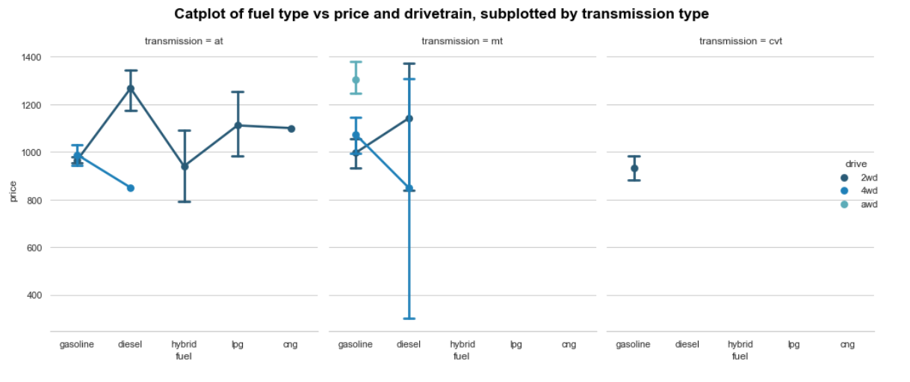

# data-visualization
> `Challenge` exercise for practice how to make plots with matplotlib and seaborn.

## Table of contents
* [General info](#general-info)
* [Screenshots](#screenshots)
* [Technologies](#technologies)
* [Setup](#setup)
* [Features](#features)
* [Status](#status)
* [Contact](#contact)

## General info
The purpose of the challenge is to practice plotting using the python matplotlib library and seaborn, using a dataset with information about the an online market place in Japan for used cars.

## Screenshots

## Technologies

* Python
* Jupyter notebook

## Setup
You can clone or fork this repository and test the files.

## Features
The challenge features are as follow:

1. pairplot of the columns of the dataset.
2. Violinplot in a subplot grid of price, year and fueltype.
3. Pie chart of the top ten automakers.
4. Catplot of fuel type vs price and drivetrain, subplotted by transmission type.
5. Boxplot and distribution of cars mileage by fuel type.

## Status
Challenge is: finished, final version.

## Contact
Created by [@ferrycosv](www.github.com/ferrycosv) and [@Maarten-Vandaele](www.github.com/Maarten-Vandaele) - feel free to contact us!
